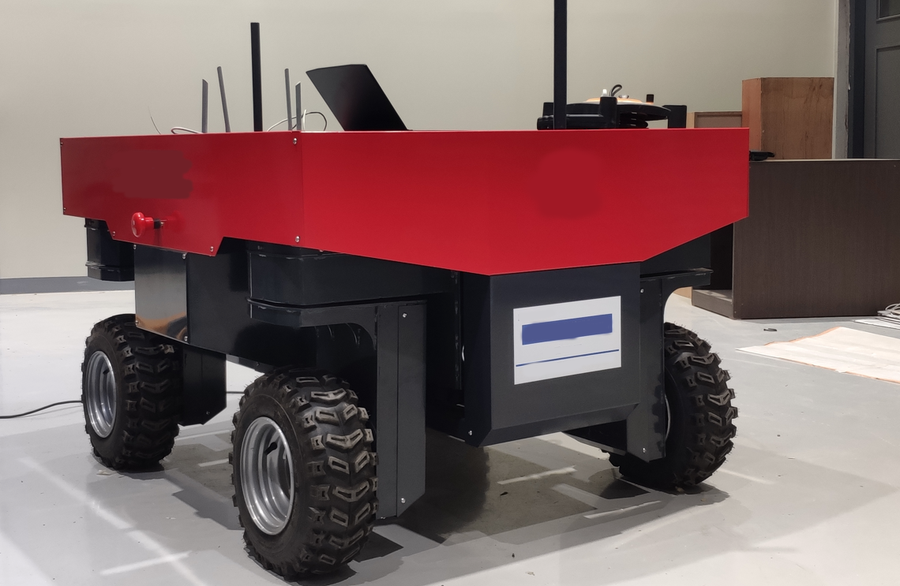

# LNS-Robot

<a name="readme-top"></a>

<!-- TABLE OF CONTENTS -->
<details>
  <summary>Table of Contents</summary>
  <ol>
    <li>
      <a href="#about-the-project">About The Project</a>
    </li>
    <li>
      <a href="#getting-started">Getting Started</a>
      <ul>
        <li><a href="#software-prerequisites">Software Prerequisites</a></li>
        <li><a href="#hardware-prerequisites">Hardware Prerequisites</a></li>
        <li><a href="#installation">Installation</a></li>
      </ul>
    </li>
    <li><a href="#usage-ranger-robot">Usage LNS Robot</a></li>
    <li><a href="#usage-simulation">Usage Simulation</a></li>
    <li><a href="#gazebo">Gazebo</a></li>
    <li><a href="#results">Results</a></li>
    <li><a href="#license">License</a></li>
  </ol>
</details>


## About The Project
Military project for an autonomous  4 wheel independent steering robot using GPS and IMU.



<!-- GETTING STARTED -->
## Getting Started

### Software Prerequisites
* Ubuntu 20.04
* ROS Noetic

### Hardware Prerequisites
* [GPS TDR-3000](https://www.synerex.kr/en/tdr-3000)
* [IMU LPMS-IG1](https://lp-research.com/9-axis-imu-with-gps-receiver-series/)

<p align="right">(<a href="#readme-top">back to top</a>)</p>

<!-- INSTALLATION -->
### Installation
1. Install dependencies
   ```sh
   # CAN
   sudo apt-get install ros-noetic-ros-canopen
   # NMEA GPS Package
   sudo apt-get install python3-testresources
   sudo apt-get install ros-noetic-catkin-virtualenv
   # TEB Local Planner
   sudo apt-get install ros-noetic-teb-local-planner
   # Robot Localization Package
   sudo apt-get install ros-noetic-robot-localization
   # GPS Plugin
   sudo apt-get install ros-noetic-hector-gazebo-plugins
   # Move Base Package
   sudo apt-get install ros-noetic-move-base
   
   # Keyboard control
   sudo apt install ros-noetic-teleop-twist-keyboard
   # Joystick control
   sudo apt install ros-noetic-joy
   ```
2. Clone the repo
   ```sh
   git clone https://github.com/mefisto2017/LNS-Robot
   ```
3. Compile
   ```sh
   cd ./LNS-Robot && catkin_make
   ```
<p align="right">(<a href="#readme-top">back to top</a>)</p>


<!-- USAGE LNS ROBOT -->
## Usage of the robot
1. Prepare the CAN bus and Joystick
```sh
# CAN0
sudo ip link set can0 up type can bitrate 1000000
# CAN1
sudo ip link set can1 up type can bitrate 1000000
# Joystick
sudo chmod a+rw /dev/input/js0
```

2. Initialize IMU and GPS
```sh
roslaunch lns_launch nav_sensors.launch
```

3. Launch the CAN buses
```sh
roslaunch lns_launch can_bus.launch
```

4. Bringup driving motor interface
```sh
roslaunch lns_bringup bringup_driving.launch
```

5. Bringup steering motor interface
```sh
roslaunch lns_bringup bringup_steering.launch
```

6. Launch driving motors interface
```sh
roslaunch driving_pid driving_pid.launch
roslaunch driving_motors driving_motors.launch
```

7. Launch steering motors interface
```sh
roslaunch steering_motors steering_feedback.launch
roslaunch steering_pid steeringposition_pid.launch
roslaunch steering_motors steering_motors.launch
```

8. URDF, TF and joint transforms:
```sh
roslaunch lns_bringup lns_bringup.launch
```

9. Controller interface:
```sh
# Swerve Controller
roslaunch lns_controller main_controller_swerve.launch
```

10. Then the whole navigation system can be launch using:
```sh
roslaunch lns_launch lns_real.launch
```

This will launch:
- The navigation sensor (GPS & IMU) package
- The localization package
- The navigation package

Keyboard control:
```sh
# Keyboard
roslaunch lns_teleop teleop_keyboard_swerve.launch
# Joystick
roslaunch lns_teleop teleop_joystick_swerve.launch 
```


## Usage Simulation
The simulation can be launch using:
```
roslaunch lns_launch lns_sim.launch
```

This will launch:
- The gazebo environment
- The localization package
- The navigation package
- The move base package

<!-- GAZEBO -->
### Gazebo
1. Start the gazebo simulation environment.
```sh
roslaunch lns_gazebo empty_world.launch
```
2. Start the robot control package.
```sh
roslaunch lns_controller main_controller_sim.launch
```

3. Start the robot_localization package.
```sh
roslaunch lns_navigation start_navigation_with_gps_ekf_sim.launch 
```

3. Start the move base package.
```sh
roslaunch lns_navigation move_sim.launch
```
<p align="right">(<a href="#readme-top">back to top</a>)</p>


<!-- RESULTS -->
## Results
<p align="right">(<a href="#readme-top">back to top</a>)</p>


<!-- LICENSE -->
## License
<p align="right">(<a href="#readme-top">back to top</a>)</p>


